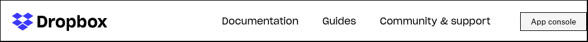
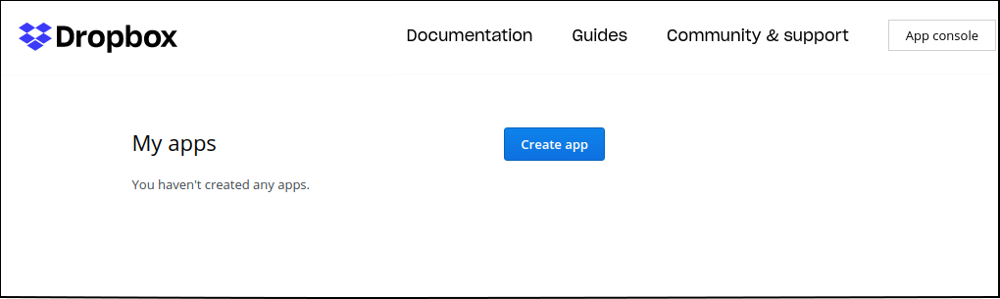
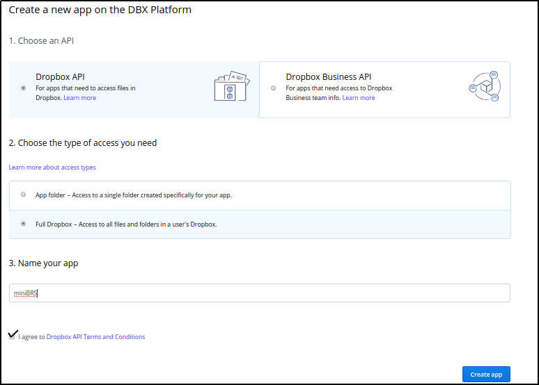
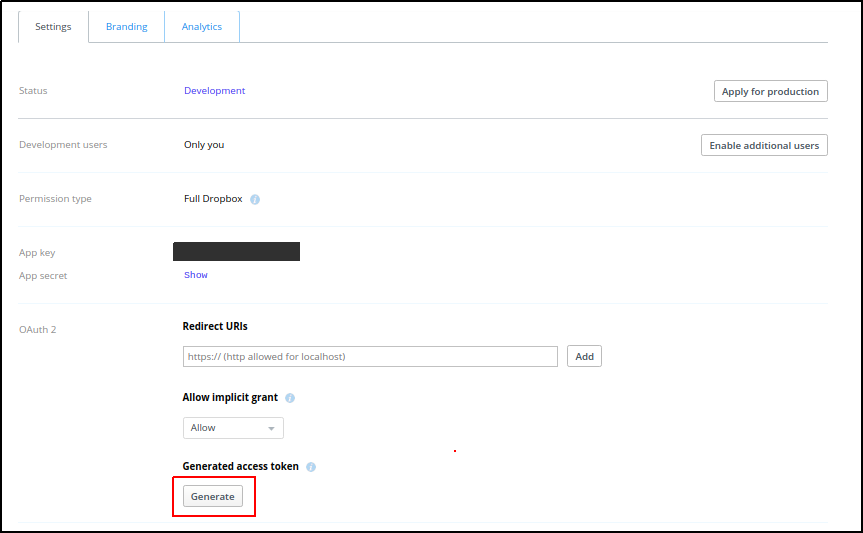
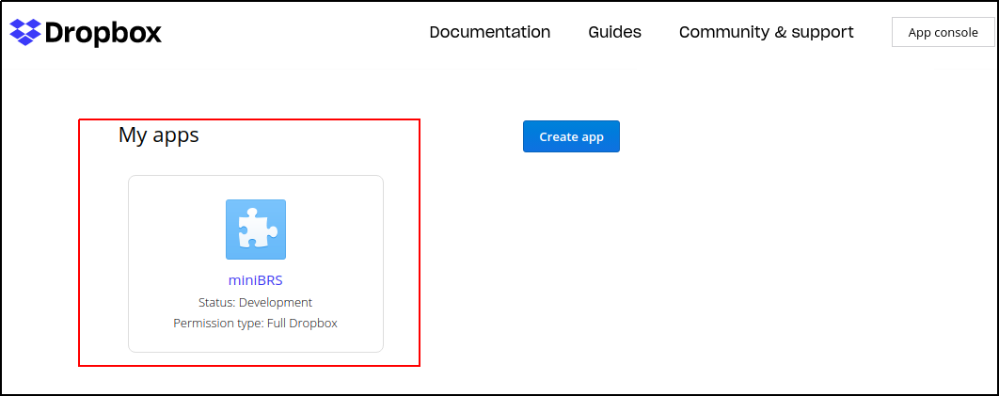

#How to get access tokens for Dropbox storage

**Get access token**

Here we will discuss the steps for generating the access tokens in `Dropbox`.

**Step 1:** Visit the URL  `www.dropbox.com/developers`. It will navigate you to the 
`App Console` page. 
 Click on the `App Console` menu, it will navigate you the login page. Login with your credentials.
 
  

**Step 2:** Once the login is done, a `Create app` button appears in the `App Console`

  
  
  Click in the `Create app` button and a `DBX Platform` will appear, choose the options as shown below:
  
   * For `Choose an Api` option select `Dropbox API`. 
   * For `type access` select `Full Dropbox`.
   * And in the last field choose any name for your `app`.
  
  
   
  After selecting all options as shown above, click on the `Create app` at the bottom right. 
  
**Step 3:**
  In the `Settings` tab  hit the `Generate` button and your access token will be generated. Select the access token, copy it and paste
  it into the `login field` of `dropbox_default` connection in the `Airflow UI`.
  
  
  
  
  
If you have to generate the access token in future again, you have to select the app badge (with the same name you type for your app)
in the `App Console` after login. It will directly navigate you to the page where you `Generate` your access token.

   